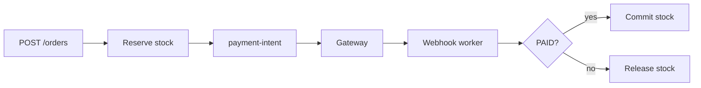

# Payment Webhook

Production-style **payments + inventory** demo: async workers, idempotent webhooks, Amazon-style stock reservation, and operational recovery (DLQ, sweeps, metrics).

**Docs:** [Payment & inventory flow](./docs/paymentflow.md) · [Frontend](./apps/web/README.md) · [All documentation](./docs/README.md) · [Prisma & seeder](./backend/prisma/README.md) · [Config](./backend/src/config/README.md) · [Inventory](./backend/src/modules/inventory/README.md) · [Queue](./backend/src/modules/queue/README.md)

---

## Table of contents

- [Quick start](#quick-start)
- [What this project demonstrates](#what-this-project-demonstrates)
- [Tech stack](#tech-stack)
- [Project structure](#project-structure)
- [Inventory](#inventory)
- [Payment flow](#payment-flow)
- [APIs](#apis)
- [Order statuses](#order-statuses)
- [Background jobs](#background-jobs)
- [Concurrency & idempotency](#concurrency--idempotency)
- [Environment variables](#environment-variables)
- [Local setup](#local-setup)
- [Prisma & database](#prisma--database)
- [Operations](#operations)
- [Development](#development)

---

## Quick start

```bash
docker compose up --build
```

| Service | URL |
| ------- | --- |
| Frontend | http://localhost:8080 |
| Backend | http://localhost:3000 |
| Adminer | http://localhost:8081 |
| PostgreSQL | localhost:5432 |
| Redis | localhost:6379 |

After Postgres is up:

```bash
docker compose exec backend npm run prisma:deploy
docker compose exec backend npm run db:seed
```

Check inventory: `GET http://localhost:3000/inventory/products`

---

## What this project demonstrates

- **Async processing** — BullMQ workers decouple HTTP from gateway calls
- **Idempotent webhooks** — signature check, `ProcessedEvent`, safe retries
- **Strong consistency** — `prisma.$transaction` + `SELECT … FOR UPDATE`
- **Inventory holds** — reserve at checkout, commit on pay, release on fail/timeout
- **Self-healing** — expiry and reconciliation sweeps
- **Ops** — DLQ inspection/replay, queue metrics

---

## Tech stack

| Layer | Stack |
| ----- | ----- |
| Backend | NestJS 11, CQRS, BullMQ, Prisma 5, PostgreSQL, Redis, Zod |
| Frontend | Next.js 16, React 19, Tailwind CSS 4 |
| Tooling | Docker Compose, ESLint, Prettier, Jest, Husky |

---

## Project structure

```text
PaymentWebhook/
├── backend/
│   ├── prisma/                    # CLI: schema, migrations, seeder/
│   │   ├── schema.prisma
│   │   ├── migrations/
│   │   └── seeder/                # product + demo-order seeders
│   ├── src/
│   │   ├── main.ts
│   │   ├── app.module.ts          # AppConfig + PrismaModule + BullMQ + features
│   │   ├── config/                # AppConfigService (global env)
│   │   ├── database/prisma/       # Nest: prisma.module, prisma.service, prisma.extension
│   │   ├── integrations/        # redis, bullmq, mail, storage, elasticsearch
│   │   ├── shared/                # dto/, filters/, pipes/, helpers/
│   │   └── modules/               # Domain only (see feature-modules.ts)
│   │       ├── order/
│   │       ├── payment/
│   │       ├── payment-gateway/
│   │       ├── webhook/           # includes idempotency
│   │       ├── inventory/
│   │       ├── queue/             # processors/ + BullMQ jobs
│   │       ├── locks/
│   │       └── reconciliation/
│   └── .env.example
├── apps/web/                      # Next.js checkout UI
├── docs/                          # Flow guides
└── docker-compose.yml
```

- **Infrastructure** (not in `modules/`): `config/`, `database/prisma/`, `integrations/`, root `prisma/`
- **Feature modules:** `backend/src/modules/feature-modules.ts`
- **Layering:** `Controller` → `Command` / `Query` → `Handler` → `Service` → `Repository`

---

## Inventory

ERP-style **reserve stock** (`available = total_stock - reserved_stock`). Reservation rows are **kept for audit** (`RESERVED` → `CONFIRMED`, not deleted).

| Step | When | `reserved_stock` | `available` | `total_stock` |
| ---- | ---- | ---------------- | ----------- | ------------- |
| **1. Create order** | `POST /orders` + `items` | ↑ | ↓ | unchanged |
| **2. Payment pending** | `PROCESSING` | unchanged | unchanged | unchanged |
| **3. Payment success** | `PAID` | ↓ → 0 | unchanged | ↓ (sold) |
| **4. Fail / cancel / TTL** | `FAILED`, `CANCELLED`, `EXPIRED` | ↓ | ↑ | unchanged |

Example: 100 on-hand, reserve 10 → available 90. After pay: total **90**, reserved **0**, available **90**.

Events: `OrderCreated` → reserve · `PaymentCompleted` → confirm · `PaymentExpired` → release.  
Full detail: [docs/paymentflow.md](./docs/paymentflow.md#inventory-erp--e-commerce) · [inventory module](./backend/src/modules/inventory/README.md)

---

## Payment flow

1. **Create order** — `UNPAID`; reserve stock if `items` sent  
2. **Payment intent** — extend hold; enqueue checkout job  
3. **Worker** — create PayPal/mock session; save `approvalUrl`  
4. **Customer pays** — frontend polls `GET /orders/:id`  
5. **Webhook** — verify → persist → enqueue → worker sets `PAID` / `FAILED` / …  
6. **Sweeps** — expire stuck payments, reservations, and unpaid orders  



---

## APIs

| Method | Path | Description |
| ------ | ---- | ----------- |
| `POST` | `/orders` | Create order (optional `items`) |
| `POST` | `/orders/:id/payment-intent` | Start / retry checkout |
| `GET` | `/orders/:id` | Order status + events |
| `GET` | `/orders` | List orders (cursor pagination) |
| `POST` | `/orders/:id/capture` | Enqueue capture fallback |
| `POST` | `/webhooks/paypal` | Payment webhook intake |
| `GET` | `/inventory/products` | SKU availability (`totalStock`, `reserved`, `available`) |
| `GET` | `/inventory/orders/:orderId/reservations` | Reservation audit trail (never deleted) |
| `GET` | `/ops/metrics` | Queue metrics |
| `GET` | `/ops/dlq` | Dead-letter jobs |
| `POST` | `/ops/dlq/:jobId/replay` | Replay failed job |

**Create order example:**

```json
{
  "amount": 64.9,
  "currency": "MYR",
  "items": [
    { "sku": "wireless-mouse", "quantity": 1, "unitPrice": 39.9 },
    { "sku": "usb-c-cable", "quantity": 2, "unitPrice": 12.5 }
  ]
}
```

---

## Order statuses

| Status | Meaning |
| ------ | ------- |
| `UNPAID` | Created; stock may be reserved |
| `PROCESSING` | Payment in progress |
| `PAID` | Success; stock committed |
| `FAILED` | Payment failed |
| `CANCELLED` | Cancelled at gateway |
| `EXPIRED` | Timed out |
| `REFUNDING` / `PARTIALLY_REFUNDED` / `REFUNDED` | Refund states |

---

## Background jobs

| Job | Purpose |
| --- | ------- |
| `create-payment-intent` | Gateway checkout |
| `process-webhook` | Status + inventory update |
| `capture-payment` | Capture fallback |
| `expire-orders-sweep` | Processing timeout |
| `expire-reservations-sweep` | Reservation TTL |
| `expire-unpaid-orders-sweep` | Abandoned checkout |
| `reconcile-orders-sweep` | Gateway reconciliation |
| `mock-capture-success` | Mock auto-capture |

| Setting | Typical value |
| ------- | ------------- |
| Payment/webhook attempts | 5, exponential backoff |
| Sweep attempts | 3, fixed 1s |

See [queue module README](./backend/src/modules/queue/README.md).

---

## Concurrency & idempotency

| Concern | Mechanism |
| ------- | --------- |
| Duplicate payment intent | `lock:order:intent:{orderId}` |
| Duplicate webhook | `ProcessedEvent` + `lock:webhook:event:{eventId}` |
| Row races | `SELECT … FOR UPDATE` |
| Duplicate jobs | BullMQ `jobId` |
| Duplicate reservation | `reservationKey` per order + SKU |
| Hot SKU | `lock:inventory:sku:{sku}` |

---

## Environment variables

All backend env vars are loaded in **`backend/src/config/`** (see [config README](./backend/src/config/README.md)). Inject `AppConfigService` in services — avoid raw `process.env` in modules.

Copy `backend/.env.example` → `backend/.env` and `apps/web/.env.example` → `apps/web/.env.local`.

### Backend — required

| Variable | Purpose |
| -------- | ------- |
| `DATABASE_URL` | PostgreSQL |
| `BULLMQ_REDIS_HOST` / `BULLMQ_REDIS_PORT` | Redis for queues + locks |
| `PAYPAL_CLIENT_ID` / `PAYPAL_SECRET_KEY` / `PAYPAL_WEBHOOK_ID` | PayPal |
| `FRONTEND_BASE_URL` | Redirect URLs |
| `APP_BASE_URL` | Webhook callback base (mock) |

### Backend — mock mode

| Variable | Purpose |
| -------- | ------- |
| `MOCK_PAYMENT_GATEWAY` | `true` = no real PayPal UI |
| `MOCK_WEBHOOK_SECRET` | Mock webhook signing |
| `MOCK_CAPTURE_DELAY_MS` | Delay before mock capture |

### Backend — timeouts & inventory

| Variable | Default | Purpose |
| -------- | ------- | ------- |
| `ORDER_PROCESSING_EXPIRE_MS` | 900000 | Payment-in-progress TTL |
| `ORDER_EXPIRE_SWEEP_EVERY_MS` | 60000 | Processing sweep interval |
| `STOCK_RESERVATION_TTL_MS` | 900000 | Checkout hold TTL |
| `STOCK_RESERVATION_SWEEP_EVERY_MS` | 30000 | Reservation sweep interval |
| `UNPAID_ORDER_EXPIRE_MS` | 1800000 | Abandoned unpaid TTL |
| `UNPAID_ORDER_SWEEP_EVERY_MS` | 60000 | Unpaid sweep interval |

### Frontend

| Variable | Purpose |
| -------- | ------- |
| `NEXT_PUBLIC_API_BASE_URL` | Backend URL |
| `NEXT_PUBLIC_PAYPAL_SUPPORTED_CURRENCIES` | e.g. `MYR` |

---

## Local setup

### Docker (recommended)

```bash
docker compose up -d --build
docker compose logs -f backend
docker compose down          # stop
docker compose down -v       # stop + wipe volumes
```

### Without Docker

```bash
# 1. Env files from .env.example
# 2. Install
cd backend && npm install
cd ../apps/web && npm install

# 3. Backend (use PORT=3001 if frontend uses 3000)
cd backend
npm run prisma:generate
npm run prisma:migrate
npm run db:seed
npm run start:dev

# 4. Frontend
cd apps/web
npm run dev
```

Align `NEXT_PUBLIC_API_BASE_URL` with the backend port.

---

## Prisma & database

| Location | Purpose |
| -------- | ------- |
| `backend/prisma/` | Schema, migrations, **`seeder/`** (CLI) |
| `backend/src/database/prisma/` | Nest `PrismaModule` / `PrismaService` (runtime) |

Run inside `backend/`:

```bash
npm run prisma:generate   # after schema change
npm run prisma:migrate    # dev migration
npm run prisma:deploy     # production apply
npm run db:seed           # runs prisma/seeder/main.ts
```

Details: [backend/prisma/README.md](./backend/prisma/README.md)

Repositories import `PrismaService` from `../../database/prisma/prisma.service` (no barrel `index.ts`).

---

## Operations

- Failed jobs → `payment-dlq-queue` after max retries  
- `GET /ops/dlq` — inspect  
- `POST /ops/dlq/:jobId/replay` — replay  
- `GET /ops/metrics` — queue depth / health  

---

## Development

### New backend module

```bash
cd backend
npm run gen:module -- <module-name>
```

### Quality checks

```bash
# Backend
cd backend
npm run lint
npm test

# Frontend
cd apps/web
npm run lint
```

Tests live under `backend/src/**/*.spec.ts` (e.g. inventory lock-ordering).
