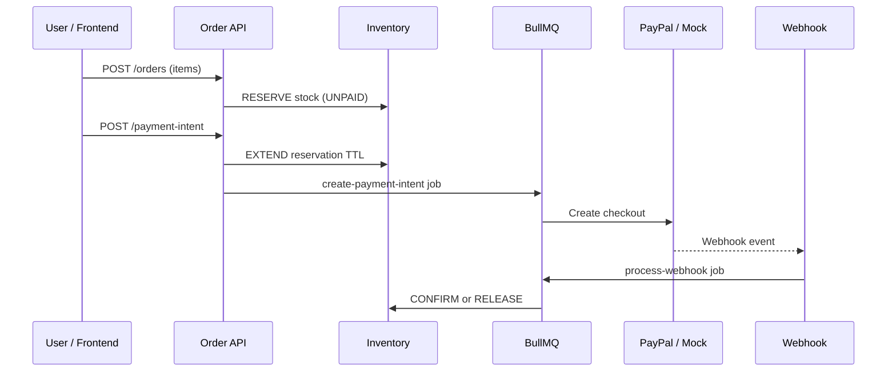
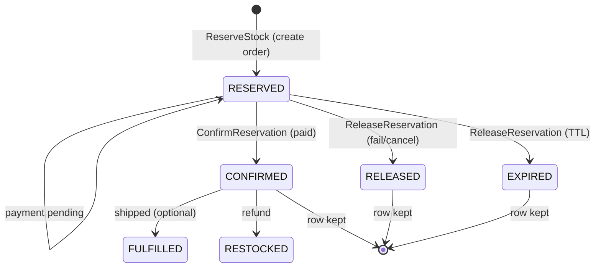

# Payment & inventory flow

How checkout, stock reservation, payment, and webhooks work in **this codebase** (NestJS + BullMQ + Prisma).

> Setup, env vars, and API list: [README](../README.md)

---

## Table of contents

1. [Goals](#goals)
2. [High-level sequence](#high-level-sequence)
3. [Order statuses](#order-statuses)
4. [Inventory (Amazon-style)](#inventory-amazon-style)
5. [Payment steps](#payment-steps)
6. [Webhooks](#webhooks)
7. [Background jobs](#background-jobs)
8. [Idempotency & locks](#idempotency--locks)
9. [Failure & refund](#failure--refund)
10. [Environment variables](#environment-variables)
11. [Commands](#commands)

---

## Goals

| Goal | How this project does it |
| ---- | ------------------------ |
| Reliable | Async workers, retries, DLQ + replay |
| Secure | Webhook signature verification |
| Idempotent | `ProcessedEvent`, deterministic BullMQ `jobId`, reservation keys |
| No oversell | Atomic SQL + row locks + per-SKU Redis locks |
| Recoverable | Sweeps for expired payments, reservations, and unpaid orders |

---

## High-level sequence



---

## Order statuses

| Status | Meaning |
| ------ | ------- |
| `UNPAID` | Order created; stock may be reserved |
| `PROCESSING` | Payment in progress at gateway |
| `PAID` | Payment captured; stock committed |
| `FAILED` | Payment failed; reservation released |
| `CANCELLED` | Payment cancelled; reservation released |
| `EXPIRED` | Checkout or payment timed out |
| `REFUNDING` / `PARTIALLY_REFUNDED` / `REFUNDED` | Refund lifecycle |

**Rule:** Terminal payment status updates run in the **async webhook worker** (inside a DB transaction), not in the HTTP webhook handler after enqueue.

---

## Inventory (ERP / e-commerce)

### Products table (`Product`)

| ERP column | Prisma field | Meaning |
| ---------- | ------------ | ------- |
| `total_stock` | `stock` | Physical units in warehouse |
| `reserved_stock` | `reservedStock` | Locked for open orders |
| `available_stock` | `stock - reservedStock` | Sellable (computed, not stored) |

`GET /inventory/products` returns `totalStock`, `reserved`, `available` (and `onHand` as alias of `totalStock`).

### Reservation table (`StockReservation`) — never `DELETE`

| ERP column | Prisma field | Notes |
| ---------- | ------------ | ----- |
| `order_id` | `orderId` | `ON DELETE RESTRICT` — order hard-delete cannot wipe audit |
| `product_id` | `productId` | |
| `qty` | `quantity` | |
| `status` | `status` | See lifecycle |
| `reserved_at` | `reservedAt` | Hold created |
| `confirmed_at` | `confirmedAt` | Payment success |
| `released_at` | `releasedAt` | Fail / cancel |
| `expired_at` | `expiredAt` | TTL sweep |
| `restocked_at` | `restockedAt` | Refund restock |
| `expires_at` | `expiresAt` | Active TTL |

**Why keep rows?** Audit trail, oversell debugging (“I paid but stock gone”), analytics (abandonment, failure rate), refunds (`CONFIRMED` → `RESTOCKED`), warehouse investigation.

**On payment success (must match):**

```text
total_stock = 90
reserved_stock = 0
reservation.status = CONFIRMED   -- UPDATE, not DELETE
reservation.confirmed_at = now()
```

**Lifecycle:**

```text
RESERVED → CONFIRMED → FULFILLED   (optional ship step; FULFILLED not auto-set yet)
RESERVED → RELEASED | EXPIRED
CONFIRMED → RESTOCKED              (refund webhook)
```

Archive old reservation rows with cron later if the table grows large.

### Ledger (`StockLedgerEntry` / `inventory_transactions`)

Append-only `reason`: `RESERVE` | `EXTEND` | `CONFIRM` | `RELEASE` | `EXPIRE` | `RESTOCK`  
(Legacy: `COMMIT`, `RESTORE_REFUND`.)

### Numeric example (qty 10 reserved from 100 on-hand)

| Type | Before pay | After pay success |
| ---- | ---------- | ----------------- |
| Physical stock (`total_stock`) | 100 | **90** |
| Reserved (`reserved_stock`) | 10 | **0** |
| Available (`total_stock - reserved_stock`) | 90 | **90** |

### Reserve stock flow

| Step | Event / API | Product row | Reservation row |
| ---- | ----------- | ----------- | --------------- |
| **1. Create order** | `OrderCreated` → `POST /orders` | `reserved_stock` ↑, `available` ↓ | `RESERVED` |
| **2. Payment pending** | `payment-intent` / `PROCESSING` | unchanged | stays `RESERVED` (extend `expiresAt`) |
| **3. Payment success** | `PaymentCompleted` → `PAID` | `total_stock` ↓, `reserved_stock` ↓ | `RESERVED` → **`CONFIRMED`** |
| **4. Failed / cancelled** | `PaymentFailed` | `reserved_stock` ↓ | `RESERVED` → **`RELEASED`** |
| **4b. TTL expired** | `PaymentExpired` sweep | `reserved_stock` ↓ | `RESERVED` → **`EXPIRED`** |



### Event-driven mapping (this codebase)

| Recommended event | Implementation |
| ----------------- | -------------- |
| `OrderCreated` → `ReserveStock` | `InventoryService.reserveAtCheckout` |
| `PaymentCompleted` → `ConfirmReservation` + `DeductInventory` | `InventoryService.commitForOrder` |
| `PaymentExpired` / failed → `ReleaseReservation` | `InventoryService.releaseForOrder` |

### When stock changes (API index)

| Step | API / event | Inventory action |
| ---- | ----------- | ------------------ |
| 1 | `POST /orders` with `items` | **Reserve** — `reservedStock` increases, order `UNPAID` |
| 2 | `POST /orders/:id/payment-intent` | **Extend** TTL (no second reserve) |
| 3 | Webhook / capture → `PAID` | **Commit** — `stock` and `reservedStock` decrease |
| 4 | `FAILED` / `CANCELLED` / `EXPIRED` | **Release** — `reservedStock` decreases |
| 5 | Refund webhook → `REFUNDED` | **Restock** — `stock` increases; reservation → `RESTOCKED` |

### Data stored

- **Product** — `stock` (total_stock), `reservedStock`, `version` (optimistic lock)
- **OrderLineItem** — `sku`, `quantity`, `unitPrice` per order
- **StockReservation** — `RESERVED` / `CONFIRMED` / `RELEASED` / `EXPIRED`, `expiresAt`, `confirmedAt`, `productId`
- **StockLedgerEntry** — append-only audit trail

### Safety mechanisms (production)

- Atomic reserve: `UPDATE … SET reservedStock = reservedStock + qty WHERE stock - reservedStock >= qty`
- `SELECT … FOR UPDATE` per SKU inside transactions
- Redis lock: `lock:inventory:sku:{sku}` (multi-instance)
- SKUs locked in sorted order (deadlock avoidance)
- DB `CHECK`: `stock >= 0`, `reservedStock >= 0`, `reservedStock <= stock`
- DB `CHECK`: reservation `status` ∈ `RESERVED` … `RESTOCKED`
- App `assertProductInventoryInvariant` after reserve / confirm / release / restock
- Ops API: `GET /inventory/orders/:orderId/reservations` (full audit row + timestamps)

### Example create order body

```json
{
  "amount": 64.9,
  "currency": "MYR",
  "items": [
    { "sku": "wireless-mouse", "quantity": 1, "unitPrice": 39.9 },
    { "sku": "usb-c-cable", "quantity": 2, "unitPrice": 12.5 }
  ]
}
```

Demo SKUs (from `backend/prisma/seeder/product.seeder.ts`, run `npm run db:seed`): `wireless-mouse`, `usb-c-cable`, `laptop-stand`.

---

## Payment steps

### 1) Create order

- Validate body (`amount`, optional `items`)
- If `items` present, `amount` must match line totals
- Persist order as **`UNPAID`**
- Reserve inventory when line items exist

### 2) Create payment intent

- Redis lock: `lock:order:intent:{orderId}`
- Row lock order; extend reservation TTL
- Set status **`PROCESSING`**; enqueue `create-payment-intent`
- Worker calls PayPal (or mock) and stores `paypalOrderId` + `approvalUrl`

### 3) Customer pays

- Frontend polls `GET /orders/:id` for `approvalUrl` / status
- Gateway sends webhook to `POST /webhooks/paypal`

### 4) Async status update

- Verify signature → idempotency check → save `WebhookEvent` → enqueue `process-webhook`
- Worker updates order status and inventory in one transaction

---

## Webhooks

### Intake (HTTP)

1. **Verify signature** — invalid → `400`
2. **Idempotency** — if `eventId` already in `ProcessedEvent` → `200` (no-op)
3. **Persist** `WebhookEvent` + enqueue job → **`200`** so the provider stops retrying

Idempotency logic lives under `modules/webhook` (with `modules/idempotency` helpers).

### Processing (worker)

Example event patterns handled:

- Success: `SUCCEEDED`, `COMPLETED`
- Failure: `FAILED`
- Cancel: `CANCELLED`, `VOIDED`, `DENIED`
- Refund: `REFUND` in type or status → `REFUNDED` + restore stock

Providers typically retry with exponential backoff until they receive `200`.

---

## Background jobs

| Job | Purpose |
| --- | ------- |
| `create-payment-intent` | Create gateway checkout |
| `process-webhook` | Apply payment result + inventory |
| `capture-payment` | Manual capture fallback |
| `expire-orders-sweep` | `PROCESSING` → `EXPIRED` + release stock |
| `expire-reservations-sweep` | Release `RESERVED` reservations past `expiresAt` → `EXPIRED` |
| `expire-unpaid-orders-sweep` | `UNPAID` → `EXPIRED` when hold expired |
| `reconcile-orders-sweep` | Align stuck orders with gateway status |
| `mock-capture-success` | Mock mode auto-capture |

Workers live in `backend/src/modules/queue/processors/`. Details: [queue module README](../backend/src/modules/queue/README.md).

---

## Idempotency & locks

| Concern | Mechanism |
| ------- | --------- |
| Duplicate payment intent | `lock:order:intent:{orderId}` |
| Duplicate webhook | `ProcessedEvent` + `lock:webhook:event:{eventId}` |
| Lost updates | `SELECT … FOR UPDATE` on `Order` / `Product` |
| Duplicate queue work | BullMQ `jobId` (e.g. `create-{orderId}`) |
| Duplicate reservation | `reservationKey` = `reserve:{orderId}:{sku}` |

---

## Failure & refund

| Event | Order status | Inventory |
| ----- | -------------- | --------- |
| Payment failed | `FAILED` | Release |
| Cancelled / voided | `CANCELLED` | Release |
| Processing timeout | `EXPIRED` | Release |
| Reservation TTL | (order may stay `UNPAID` then `EXPIRED`) | Release |
| Full refund webhook | `REFUNDED` | Restore on-hand |

User can retry payment from `FAILED` / `EXPIRED` / `CANCELLED` via a new `payment-intent` (extends or re-reserves as needed).

---

## Environment variables

Inventory-related (see `backend/.env.example`):

| Variable | Default | Role |
| -------- | ------- | ---- |
| `STOCK_RESERVATION_TTL_MS` | `900000` | Checkout hold (15 min) |
| `STOCK_RESERVATION_SWEEP_EVERY_MS` | `30000` | Reservation expiry sweep interval |
| `ORDER_PROCESSING_EXPIRE_MS` | `900000` | Payment-in-progress TTL |
| `ORDER_EXPIRE_SWEEP_EVERY_MS` | `60000` | Processing expiry sweep |
| `UNPAID_ORDER_EXPIRE_MS` | `1800000` | Abandoned unpaid order TTL |
| `UNPAID_ORDER_SWEEP_EVERY_MS` | `60000` | Unpaid cleanup sweep |

---

## Commands

From repo root:

```bash
docker compose up --build
```

From `backend/`:

```bash
npm run prisma:generate
npm run prisma:deploy
npm run db:seed          # prisma/seeder/main.ts
npm run lint
npm test
```
