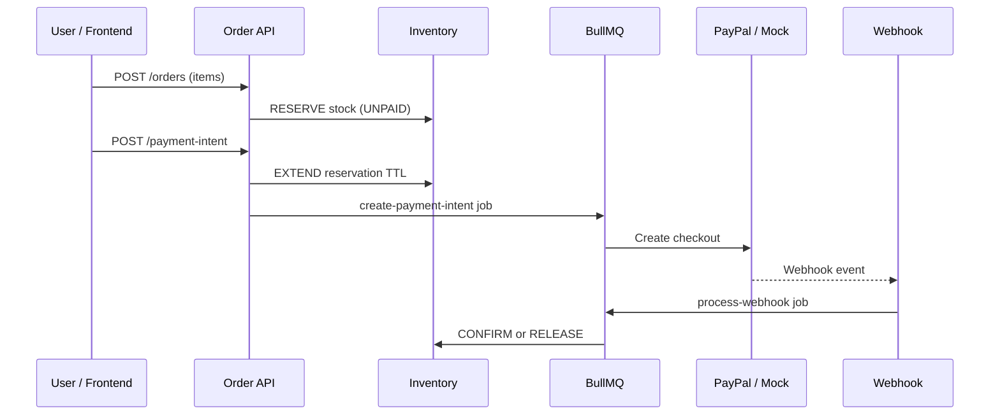
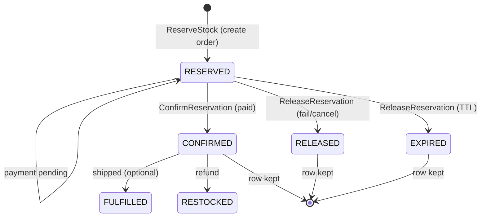

# Payment and inventory flow

This doc explains what happens when a customer checks out: how stock is held, how PayPal (or mock) payment runs, and how webhooks update the order.

Stack: NestJS, BullMQ, Prisma, PostgreSQL, Redis.

**Setup and API list:** [README](../README.md)

---

## What we are trying to achieve

| Goal | How this repo does it |
| ---- | --------------------- |
| Payments do not block the API forever | Slow work runs in BullMQ workers |
| Webhooks can be retried safely | Signature check + `ProcessedEvent` dedup |
| No double charges or double reserves | Locks + idempotent job and reservation keys |
| No overselling | DB transactions, row locks, per-SKU Redis locks |
| Stuck orders get cleaned up | Scheduled sweep jobs |

---

## Big picture (one checkout)

1. Customer creates an order (`POST /orders`). Stock is **reserved**; order is `UNPAID`.
2. Customer starts checkout (`POST /orders/:id/payment-intent`). Hold is extended; a worker opens PayPal (or mock).
3. Customer pays in PayPal. Provider sends a webhook.
4. Webhook is verified and queued. A worker sets order to `PAID` (or failed/cancelled) and **commits** or **releases** stock.



---

## Order statuses

| Status | Meaning |
| ------ | ------- |
| `UNPAID` | Order exists; stock may be reserved |
| `PROCESSING` | Customer is paying at the gateway |
| `PAID` | Paid; stock committed (sold) |
| `FAILED` | Payment failed; hold released |
| `CANCELLED` | Cancelled at gateway; hold released |
| `EXPIRED` | Timed out |
| `REFUNDING` / `PARTIALLY_REFUNDED` / `REFUNDED` | Refund in progress or done |

**Important:** The HTTP webhook handler only saves the event and enqueues work. The real status change happens in the **worker**, inside one database transaction.

---

## Inventory in plain language

We do not subtract stock at “add to cart.” We **reserve** it until payment succeeds or the hold expires.

### Product row (`Product`)

| Name you will see | DB field | Meaning |
| ----------------- | -------- | ------- |
| Total on hand | `stock` | Physical quantity |
| Held for orders | `reservedStock` | Locked but not sold yet |
| Available to sell | (computed) | `stock - reservedStock` |

`GET /inventory/products` returns `totalStock`, `reserved`, `available`.

### Reservation row (`StockReservation`)

Each hold is one row per order line. We **do not delete** these rows; we change `status` for audit.

| Field | Purpose |
| ----- | ------- |
| `orderId`, `productId`, `sku`, `quantity` | What is held |
| `status` | `RESERVED`, `CONFIRMED`, `RELEASED`, `EXPIRED`, `RESTOCKED`, … |
| `reservedAt`, `confirmedAt`, `releasedAt`, … | Timeline |
| `expiresAt` | When the hold times out |
| `reservationKey` | Stops double reserve (`reserve:{orderId}:{sku}`) |

Deleting an order is blocked (`ON DELETE RESTRICT`) so history is not wiped by mistake.

**Status changes over time:**

```text
RESERVED, then CONFIRMED, then FULFILLED   (ship step optional; FULFILLED not auto-set yet)
RESERVED, then RELEASED or EXPIRED         (fail, cancel, or timeout)
CONFIRMED, then RESTOCKED                  (refund)
```

**After successful payment the numbers look like this:**

```text
total_stock = 90
reserved_stock = 0
reservation.status = CONFIRMED   (UPDATE the row; do not DELETE it)
reservation.confirmed_at = now()
```

### Ledger (`StockLedgerEntry`)

Append-only log: `RESERVE`, `EXTEND`, `CONFIRM`, `RELEASE`, `EXPIRE`, `RESTOCK` (older rows may say `COMMIT` or `RESTORE_REFUND`).

### Example: 100 in warehouse, customer reserves 10

| | Before pay | After pay |
| - | ---------- | --------- |
| On hand (`stock`) | 100 | **90** |
| Reserved | 10 | **0** |
| Available | 90 | **90** |

### Step by step

| Step | What happens | Product row | Reservation |
| ---- | ------------ | ----------- | ----------- |
| 1. Create order | `POST /orders` with items | Reserved goes up, available goes down | `RESERVED` |
| 2. Paying | `payment-intent`, order `PROCESSING` | No change | Stays `RESERVED`; TTL extended |
| 3. Paid | Webhook or capture | On hand down, reserved down | `CONFIRMED` |
| 4. Failed / cancelled | Payment failed | Reserved down | `RELEASED` |
| 4b. Hold timed out | Sweep job | Reserved down | `EXPIRED` |



### Code that moves stock

| Business moment | Service method |
| --------------- | -------------- |
| Order created with items | `InventoryService.reserveAtCheckout` |
| Payment succeeded | `InventoryService.commitForOrder` |
| Payment failed, expired, or cancelled | `InventoryService.releaseForOrder` |
| Refund | `InventoryService.restoreForRefund` |

### Safety checks

- SQL only reserves if enough available stock
- `SELECT … FOR UPDATE` on product rows inside transactions
- Redis lock per SKU when multiple API instances run
- SKUs locked in sorted order (avoids deadlocks)
- DB checks: stock and reserved never negative; reserved never above stock
- App checks invariants after each change
- Audit API: `GET /inventory/orders/:orderId/reservations`

### Sample order body

```json
{
  "amount": 64.9,
  "currency": "MYR",
  "items": [
    { "sku": "wireless-mouse", "quantity": 1, "unitPrice": 39.9 },
    { "sku": "usb-c-cable", "quantity": 2, "unitPrice": 12.5 }
  ]
}
```

Demo SKUs after `npm run db:seed`: `wireless-mouse`, `usb-c-cable`, `laptop-stand`.

---

## Payment steps (detail)

### 1) Create order

- Validate `amount` and optional `items`
- If `items` are sent, `amount` must match line totals
- Save order as `UNPAID`
- Reserve stock when line items exist

### 2) Create payment intent

- Redis lock: `lock:order:intent:{orderId}`
- Lock order row; extend reservation TTL
- Set order to `PROCESSING`; enqueue `create-payment-intent`
- Worker talks to PayPal or mock; saves `paypalOrderId` and `approvalUrl`

### 3) Customer pays

- UI polls `GET /orders/:id`
- Gateway calls `POST /webhooks/paypal`

### 4) Apply result (async)

- Verify signature, check idempotency, save `WebhookEvent`, enqueue `process-webhook`
- Worker updates order + inventory in one transaction

---

## Webhooks

### HTTP handler (fast path)

1. **Verify signature** — bad signature returns `400`
2. **Idempotency** — if `eventId` was already processed, return `200` and do nothing
3. **Save event and enqueue** — return `200` so PayPal stops retrying

Logic lives in `modules/webhook` and `infrastructure/idempotency`.

### Worker (slow path)

Maps gateway events to order status, for example:

- Success: `SUCCEEDED`, `COMPLETED` then `PAID` and commit stock
- Failure: `FAILED` then release stock
- Cancel: `CANCELLED`, `VOIDED`, `DENIED`
- Refund: type or status contains `REFUND` then `REFUNDED` and restock

PayPal will retry until it gets `200`.

---

## Background jobs

| Job | What it does |
| --- | ------------ |
| `create-payment-intent` | Open checkout at gateway |
| `process-webhook` | Apply payment result and inventory |
| `capture-payment` | Manual capture fallback |
| `expire-orders-sweep` | `PROCESSING` orders past TTL become `EXPIRED`; release stock |
| `expire-reservations-sweep` | Old `RESERVED` rows become `EXPIRED` |
| `expire-unpaid-orders-sweep` | Abandoned `UNPAID` orders expire |
| `reconcile-orders-sweep` | Fix orders stuck in `PROCESSING` vs gateway |
| `mock-capture-success` | Auto-finish mock payments |

Workers: `backend/src/infrastructure/bullmq/workers/`.  
More: [bullmq README](../backend/src/infrastructure/bullmq/README.md), [queue README](../backend/src/infrastructure/queue/README.md).

---

## Idempotency and locks

| Problem | Fix |
| ------- | --- |
| Two payment intents for same order | `lock:order:intent:{orderId}` |
| Same webhook twice | `ProcessedEvent` + `lock:webhook:event:{eventId}` |
| Two writers on same row | `SELECT … FOR UPDATE` |
| Duplicate queue job | Stable BullMQ `jobId` (e.g. `create-{orderId}`) |
| Double reserve same line | `reservationKey` = `reserve:{orderId}:{sku}` |

---

## When things go wrong

| Situation | Order | Stock |
| --------- | ----- | ----- |
| Payment failed | `FAILED` | Release hold |
| Cancelled / voided | `CANCELLED` | Release hold |
| Payment timed out | `EXPIRED` | Release hold |
| Reservation TTL | Order may become `EXPIRED` | Release hold |
| Full refund | `REFUNDED` | Put quantity back on hand |

Customer can try again from `FAILED`, `EXPIRED`, or `CANCELLED` with a new `payment-intent`.

---

## Related env vars

From `backend/.env.example`:

| Variable | Default | Role |
| -------- | ------- | ---- |
| `STOCK_RESERVATION_TTL_MS` | `900000` | How long checkout hold lasts (15 min) |
| `STOCK_RESERVATION_SWEEP_EVERY_MS` | `30000` | How often to expire old holds |
| `ORDER_PROCESSING_EXPIRE_MS` | `900000` | Max time in `PROCESSING` |
| `ORDER_EXPIRE_SWEEP_EVERY_MS` | `60000` | How often to expire stuck processing |
| `UNPAID_ORDER_EXPIRE_MS` | `1800000` | Abandoned cart TTL |
| `UNPAID_ORDER_SWEEP_EVERY_MS` | `60000` | How often to clean unpaid orders |

---

## Commands

From repo root:

```bash
cd backend && npm run start:dev
cd apps/web && npm run dev
```

From `backend/`:

```bash
npm run prisma:generate
npm run prisma:deploy
npm run db:seed
npm run lint
npm test
```
